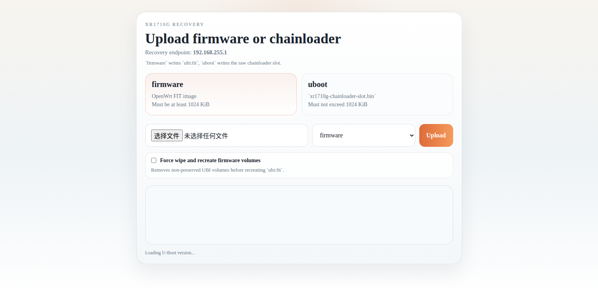

# XR1710G U-Boot

This is a customized U-Boot port for the XR1710G. Its main features are:

- 10GbE support
- HTTP Recovery for convenient web-based firmware flashing
- Built-in DHCP server so a connected PC can obtain an address automatically in recovery mode
- Recovery page address: `http://192.168.255.1`

## Entering HTTP Recovery

1. Connect your PC to the 10GbE port and leave the NIC in DHCP / automatic address mode.
2. Power on the router.
3. Once the 10GbE port LED starts blinking, press and hold the `reset` button.
4. If you are unsure about the timing, you can wait a few more seconds. Because of the chainloader, there is a fairly large timing margin here.
5. Keep holding the button until the status LED changes from solid red to a flowing pattern, which indicates that HTTP Recovery has started.
6. Open `http://192.168.255.1` in your browser.

Screenshot of the web page:



## Flash Image Notes

- `out/u-boot.bin`
  The raw secondary U-Boot payload produced by the build.
- `u-boot.img`
  One of the standard U-Boot build artifacts, but not the final flash image for the XR1710G boot chain.
- `out/xr1710g-chainloader.itb`
  An intermediate FIT-packaged artifact. It is usually not written to flash directly.
- `out/xr1710g-chainloader-slot.bin`
  The image that is actually written to the `chainloader` partition.

Upstream reference:

- OpenWrt PR `#22397`: <https://github.com/openwrt/openwrt/pull/22397>

If you are flashing the main system firmware rather than U-Boot, there are two different cases:

- HTTP Recovery web upload
  Upload the OpenWrt-generated `*-sysupgrade.itb`
  This file is written to the `fit` volume inside the `ubi` partition
- Low-level raw flashing
  You may use `out/xr1710g-ubi.img`
  This is a raw system image for the whole `ubi` partition, not the file used for HTTP Recovery upload

> [!WARNING]
> - Do not flash `u-boot.bin` directly
> - Do not treat `u-boot.img` as the final flash image
> - The final image to flash is the packaged `xr1710g-chainloader-slot.bin`

## Current Partition Layout

The current flash partition layout is:

| Name | Start | Size | End |
|---|---:|---:|---:|
| `vendor` | `0x00000000` | `0x00600000` | `0x005FFFFF` |
| `chainloader` | `0x00600000` | `0x00100000` | `0x006FFFFF` |
| `ubi` | `0x00700000` | `0x1F700000` | `0x1FDFFFFF` |
| `reserved_bmt` | `0x1FE00000` | `0x00200000` | `0x1FFFFFFF` |

Inside `vendor`, the original vendor layout is still preserved:

- `bootloader`: `0x00000000-0x001FFFFF`
- `uenv`: `0x00200000-0x003FFFFF`
- `dsd`: `0x00400000-0x005FFFFF`

This layout matches the current OP mainline layout.
In the OpenWrt tree, the upstream XR1710G DTS added by OpenWrt PR `#22397`
uses the same partition model and the same offsets for `vendor`,
`chainloader`, `ubi`, and `reserved_bmt`, and it matches the existing
`an7581-w1700k-ubi.dts` layout as well.

## Flashing the Primary `tclinux` Slot from OpenWrt

The following commands are intended for the case where:

- the device is still using the original legacy vendor partition layout
- there is not yet a dedicated `chainloader` partition
- you want to write `out/xr1710g-chainloader-slot.bin` into the primary `tclinux` slot

First, confirm that the partition names still match the old layout:

```sh
grep -E 'tclinux|tclinux_slave' /proc/mtd
```

If the primary slot is still `tclinux`, it is typically `/dev/mtd5`. It is recommended to overwrite only the first `1 MiB` of that slot. Do not use `sysupgrade`, and do not directly `mtd write ... tclinux` over the entire `64 MiB` slot.

Assuming the image has already been copied to `/tmp/xr1710g-chainloader-slot.bin` on the device, run:

```sh
# Optional: back up the first 1 MiB of the primary slot
nanddump -l 0x100000 -f /tmp/tclinux-head-1m.bin /dev/mtd5

# Erase the first 1 MiB (8 erase blocks of 128 KiB each)
flash_erase /dev/mtd5 0 8

# Write the chainloader slot image to the start of the primary slot
nandwrite -p /dev/mtd5 /tmp/xr1710g-chainloader-slot.bin

sync
reboot
```

Additional notes:

- The image written here is `out/xr1710g-chainloader-slot.bin`, not `u-boot.bin`
- These commands apply to the old layout where the primary slot is `tclinux`
- If the device has already been migrated to the new `vendor + chainloader + ubi` layout, write the `chainloader` partition directly instead of writing `tclinux`

## Why the Raw Build Artifact Cannot Be Flashed Directly

The vendor boot chain follows a `bootm` path and cannot boot a bare `u-boot.bin` directly.

Because of that, the U-Boot in this project is used as a secondary payload. An outer wrapper with a Linux `Image`-style header and a chainloader package must be added so that the vendor `bootm` path will accept it. That outer wrapper first boots a shim, and the shim then jumps to the real `u-boot.bin`.

In other words, the U-Boot artifact produced by the build cannot be flashed directly. It must first be packaged into a chainloader image with the required Linux-style header.

## Files Required for Packaging

To package the raw U-Boot payload into a flashable chainloader image, prepare:

- Raw secondary payload: `u-boot.bin`
- Vendor slot image, for example `mtd5_tclinux.bin`
  Used to preserve the first `0x2100` bytes of the original vendor image
- Shim: `chainloader-shim.bin`
- Control DTB: `chainloader-control.dtb`
- `u-boot/tools/mkimage`
- `u-boot/tools/dumpimage`

The resulting packaged artifacts are typically:

- `out/xr1710g-chainloader.itb`
- `out/xr1710g-chainloader-slot.bin`

Reference: simplified `build-chainloader-fit.sh` script contents, keeping only the core packaging logic:

```sh
#!/usr/bin/env sh
set -eu

stock_slot=xr1710g-backup/mtd5_tclinux.bin
shim=out/chainloader-shim.bin
payload=out/u-boot.bin
dtb=out/chainloader-control.dtb
output_fit=out/xr1710g-chainloader.itb
output_slot=out/xr1710g-chainloader-slot.bin
mkimage=u-boot/tools/mkimage
dumpimage=u-boot/tools/dumpimage
template=xr1710g-chainloader.its.in
tmpdir=$(mktemp -d)
its="$tmpdir/xr1710g-chainloader.its"

sed \
  -e "s|__DTB__|$dtb|g" \
  -e "s|__SHIM__|$shim|g" \
  -e "s|__PAYLOAD__|$payload|g" \
  -e "s|__KCOMP__|none|g" \
  "$template" > "$its"

"$mkimage" -f "$its" "$output_fit"
"$dumpimage" -l "$output_fit"

# Preserve the first 0x2100 bytes of the original vendor tclinux slot,
# then append the new FIT image
head -c $((0x2100)) "$stock_slot" > "$output_slot"
cat "$output_fit" >> "$output_slot"

```

## Reference Projects

- U-Boot official homepage: <https://u-boot.org/>
- U-Boot official documentation: <https://docs.u-boot.org/>
- U-Boot official source repository: <https://source.denx.de/u-boot/u-boot>
